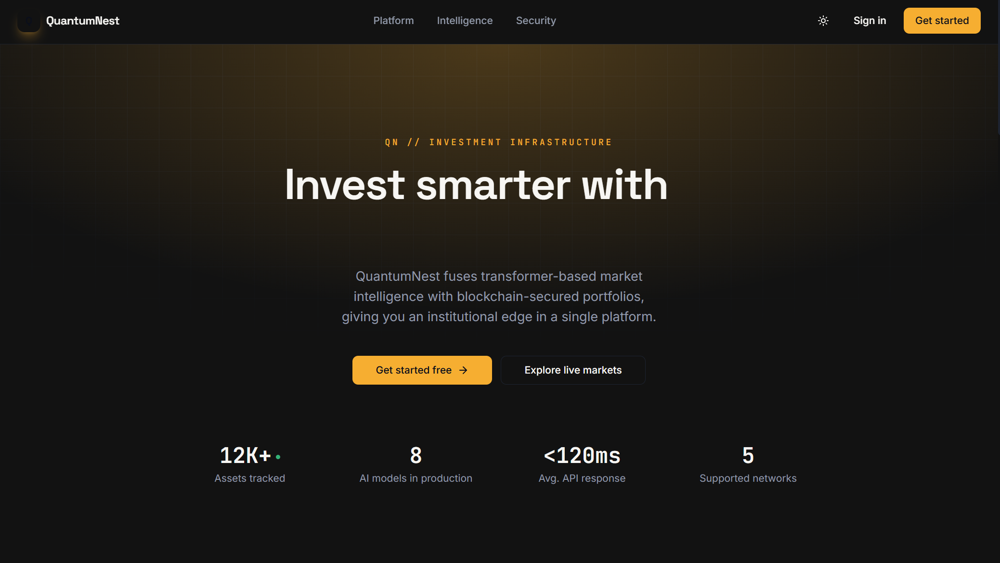

# QuantumNest


## AI-Powered Tokenized Asset Investment Platform

QuantumNest is a tokenized asset investment platform: a FastAPI backend for users, portfolios, market data, blockchain, and admin, paired with two Next.js frontends. There's no native mobile app in this repo; `mobile-frontend` is a second, separately deployed Next.js application, not a React Native or Expo project. A substantial library of ML models (LSTM, GARCH, sentiment analysis, portfolio optimization) exists under `code/backend/app/ai`, but the live API endpoints mostly return hardcoded example data rather than calling into it.

<div align="center">
  
</div>

## Table of Contents

- [Overview](#overview)
- [Project Structure](#project-structure)
- [Feature Status](#feature-status)
- [Technology Stack](#technology-stack)
- [Architecture](#architecture)
- [Installation and Setup](#installation-and-setup)
- [Running the Stack](#running-the-stack)
- [API Surface](#api-surface)
- [Testing](#testing)
- [CI/CD Pipeline](#cicd-pipeline)
- [Documentation](#documentation)
- [Contributing](#contributing)
- [License](#license)

## Overview

QuantumNest demonstrates a tokenized-asset investment workflow across a real, runnable codebase. The FastAPI backend, Hardhat smart contracts, and both Next.js frontends are wired and covered by tests. The `/ai` router is the one area with a real gap between what's callable and what's implemented: of its five task functions, only asset-price prediction calls a real model (an LSTM, trained on synthetic random data generated inline rather than real market history); portfolio optimization, sentiment analysis, portfolio risk, and market recommendations all return fixed example JSON. The underlying model classes for those (GARCH, sentiment analysis via scikit-learn and NLTK, cvxpy-based portfolio optimization, PCA, risk profiling) are real and substantial, they're just not called from the live task functions yet.

## Project Structure

```
QuantumNest/
├── code/
│   ├── backend/                # FastAPI application
│   │   ├── app/api/            # users, portfolio, market, ai, blockchain, admin
│   │   ├── app/auth/           # authentication and authorization
│   │   ├── app/ai/             # LSTM, GARCH, sentiment, portfolio optimizer,
│   │   │                       # PCA, risk profiler, fraud detection (library)
│   │   ├── app/services/       # blockchain, market data, risk management, trading
│   │   ├── app/workers/        # ai_tasks.py (backs the /ai endpoints) and a
│   │   │                       # synchronous mock task queue standing in for Celery
│   │   ├── app/main_flask.py   # Unused legacy Flask reimplementation, not the live app
│   │   └── tests/               # Backend test suite
│   └── blockchain/              # Hardhat project
│       ├── contracts/          # PortfolioManager, TokenizedAsset, TradingPlatform,
│       │                       # DeFiIntegration, TestToken
│       └── test/                # Hardhat test suite
├── web-frontend/                 # Next.js app
├── mobile-frontend/                # A second, separately deployed Next.js app
│                                    # (deployed to Cloudflare Workers via OpenNext;
│                                    # not a native mobile app)
├── infrastructure/                  # Docker, Kubernetes, Terraform, Ansible, monitoring
├── scripts/                         # Setup, run, test, lint, and dependency-check scripts
├── docs/                            # Documentation (this directory)
└── README.md
```

## Feature Status

### Application tier (wired and tested)

| Component             | Details                                                                                                                                                                                                                                                                 |
| :-------------------- | :---------------------------------------------------------------------------------------------------------------------------------------------------------------------------------------------------------------------------------------------------------------------- |
| **API**               | FastAPI backend exposing endpoints for users (including auth), portfolio, market, ai, blockchain, and admin, running via uvicorn.                                                                                                                                       |
| **Auth**              | JWT sessions (python-jose), bcrypt password hashing, and TOTP-based MFA (pyotp). `SECRET_KEY` and `API_SECRET_KEY` are randomly generated per process by default, must be at least 32 characters, and a startup check requires them to be explicitly set in production. |
| **Market data**       | Real yfinance and Alpha Vantage integrations for prices and history.                                                                                                                                                                                                    |
| **Smart contracts**   | Hardhat-managed Solidity contracts (`PortfolioManager`, `TokenizedAsset`, `TradingPlatform`, `DeFiIntegration`), read and written via a genuine web3.py service.                                                                                                        |
| **Task queue**        | A synchronous, in-process mock (`MockCeleryApp`) stands in for Celery and Redis as the task backend; it mimics the Celery API but runs tasks immediately in the same process.                                                                                           |
| **Web frontend**      | Next.js 15, React 19, and TypeScript, with Tailwind CSS, Recharts, and ethers.js 5, covering Home, Dashboard, Market Analysis, Blockchain Explorer, Recommendations, Admin, Settings, and authentication screens.                                                       |
| **"Mobile" frontend** | A second Next.js 15 and TypeScript app with its own copy of the same page set (dashboard, portfolio, market-analysis, blockchain-explorer, recommendations, admin, settings), deployed separately to Cloudflare Workers via OpenNext.                                   |

### Research tier (library modules, mostly not wired to a live endpoint)

| Component                                                                           | Details                                                                                                                                                                                                                                                                                  |
| :---------------------------------------------------------------------------------- | :--------------------------------------------------------------------------------------------------------------------------------------------------------------------------------------------------------------------------------------------------------------------------------------- |
| **LSTM price prediction**                                                           | A real TensorFlow/Keras LSTM, genuinely instantiated and trained by the `/ai/predict/asset/{symbol}` endpoint, but on synthetic random data generated inline rather than real market history; its reported error metrics are also hardcoded rather than computed from that training run. |
| **GARCH volatility model**                                                          | Implemented with the `arch` package; not called by any live endpoint.                                                                                                                                                                                                                    |
| **Sentiment analyzer**                                                              | A scikit-learn and NLTK pipeline (TF-IDF, logistic regression, SVM, Naive Bayes, Random Forest); not called by any live endpoint, which instead returns a fixed example sentiment score.                                                                                                 |
| **Portfolio optimizer**                                                             | A cvxpy-based optimizer; not called by any live endpoint, which instead returns a fixed set of example weights.                                                                                                                                                                          |
| **Risk profiler, PCA analyzer, fraud detection, financial advisor (OpenAI-backed)** | All implemented as standalone classes; none are called by the live `/ai` router.                                                                                                                                                                                                         |

## Technology Stack

| Area                 | Technology                                                                                    |
| :------------------- | :-------------------------------------------------------------------------------------------- |
| Backend API          | Python 3.11+, FastAPI, uvicorn, Pydantic v2                                                   |
| Auth                 | python-jose (JWT), passlib/bcrypt, pyotp (MFA)                                                |
| Data layer           | SQLAlchemy 2, Alembic, PostgreSQL, Redis (caching)                                            |
| ML / Quant (library) | TensorFlow/Keras (LSTM), arch (GARCH), scikit-learn, NLTK, cvxpy, xgboost, statsmodels        |
| Market data          | yfinance, Alpha Vantage                                                                       |
| AI text              | OpenAI API (used by the financial-advisor module)                                             |
| Blockchain           | Solidity, Hardhat, web3.py                                                                    |
| Web frontend         | Next.js 15, React 19, TypeScript, Tailwind CSS, Recharts, ethers.js 5                         |
| "Mobile" frontend    | Next.js 15, React 19, TypeScript, Tailwind CSS, deployed via Cloudflare Workers/OpenNext      |
| Infrastructure       | Docker, Docker Compose, Kubernetes, Terraform, Ansible                                        |
| Monitoring           | Prometheus, Grafana, structlog, Sentry SDK, prometheus-client                                 |
| CI/CD                | GitHub Actions                                                                                |
| Testing              | pytest (backend), Hardhat (contracts), Jest (web); mobile-frontend has its own Jest suite too |

## Architecture

```
Clients
  ├── web-frontend (Next.js)             ── HTTP/JSON ──┐
  └── mobile-frontend (Next.js, separate deploy) ── HTTP/JSON ──┤
                                                        ▼
Backend (FastAPI)
  ├── Routers    users (+auth), portfolio, market, ai, blockchain, admin
  ├── Services    blockchain (web3.py), market data, risk management, trading
  ├── Workers      ai_tasks.py, running on an in-process mock task queue
  └── Data layer     PostgreSQL (SQLAlchemy + Alembic), Redis

Blockchain (Hardhat / Solidity)
  PortfolioManager · TokenizedAsset · TradingPlatform · DeFiIntegration

AI library (code/backend/app/ai)
  LSTM (wired, trained on synthetic data) · GARCH · sentiment analyzer
  portfolio optimizer · PCA analyzer · risk profiler · fraud detection
  (implemented, not called by the live /ai endpoints except the LSTM)
```

See [docs/ARCHITECTURE.md](docs/ARCHITECTURE.md) for detail.

## Installation and Setup

Prerequisites: Python 3.11+ and Node.js 20+.

```bash
git clone https://github.com/quantsingularity/QuantumNest.git
cd QuantumNest

# Blockchain
cd code/blockchain
npm install

# Backend
cd ../backend
python -m venv .venv && source .venv/bin/activate
pip install -r requirements.txt

# Web frontend
cd ../../web-frontend
npm install

# "Mobile" frontend
cd ../mobile-frontend
npm install
```

For an automated setup:

```bash
git clone https://github.com/quantsingularity/QuantumNest.git
cd QuantumNest
./scripts/setup_quantumnest_env.sh
./scripts/run_quantumnest.sh
```

Full, environment-specific instructions are in [docs/INSTALLATION.md](docs/INSTALLATION.md).

## Running the Stack

```bash
# 1) Supporting services (from code/, Docker required)
docker compose up -d db redis

# 2) Local chain (from code/blockchain)
npx hardhat node                   # local chain at http://127.0.0.1:8545

# 3) Backend (from code/backend, venv active)
python run_flask.py                # despite the filename, this launches the FastAPI
                                    # app via uvicorn at http://127.0.0.1:8000, docs at /docs

# 4) Web frontend (from web-frontend)
npm run dev

# 5) "Mobile" frontend (from mobile-frontend)
npm run dev
```

See [docs/USAGE.md](docs/USAGE.md) and [docs/CONFIGURATION.md](docs/CONFIGURATION.md).

## API Surface

Base URL `http://127.0.0.1:8000`. Interactive docs at `/docs` (Swagger) and `/redoc`.

| Group        | Prefix        | Highlights                                                                                                                        |
| :----------- | :------------ | :-------------------------------------------------------------------------------------------------------------------------------- |
| Users / Auth | `/users`      | `login`, `me`, `password-reset/request`, `password-reset/confirm`, `{user_id}`                                                    |
| Portfolio    | `/portfolio`  | list/create, `{id}`, `{id}/assets`, `{id}/performance`, `{id}/summary`                                                            |
| Market       | `/market`     | `assets`, `assets/{id}/price`, `assets/{id}/price_history`, `market_summary`, `market_news`, `sector_performance`, `transactions` |
| AI           | `/ai`         | `predict/asset/{symbol}`, `optimize/portfolio/{id}`, `sentiment/asset/{symbol}`, `risk/portfolio/{id}`, `recommendations/market`  |
| Blockchain   | `/blockchain` | `contracts`, `transactions`, `wallet/{address}/balance`, `deploy/contract`, `tokenization/assets`, `networks`                     |
| Admin        | `/admin`      | `dashboard`, `users`, `users/{id}/status`, `system/logs`, `system/backup`, `announcements`                                        |

Full request and response shapes are in [docs/API.md](docs/API.md).

## Testing

```bash
# Backend (from code/backend)
pytest

# Smart contracts (from code/blockchain)
npx hardhat test

# Web frontend (from web-frontend)
npm test

# "Mobile" frontend (from mobile-frontend)
npm test

# All components, via the project script
./scripts/run_all_tests.sh
```

The backend suite has 9 test files. The Hardhat suite has 5 files covering the contracts. The web frontend has 3 test files, and the mobile-frontend Next.js app has its own 3-file Jest suite.

## CI/CD Pipeline

GitHub Actions (`.github/workflows/cicd.yml`) runs four jobs on push, pull request, and manual dispatch:

| Job                  | Depends on          | What it does                                                                       |
| :------------------- | :------------------ | :--------------------------------------------------------------------------------- |
| Code Quality Checks  | -                   | Python formatter checks (autoflake, black) and a repository-wide Prettier check    |
| Backend Tests        | Code Quality Checks | Runs the pytest suite with coverage and uploads the coverage report as an artifact |
| Smart Contract Tests | Code Quality Checks | Compiles the contracts with Hardhat and runs the contract test suite with coverage |
| Frontend Build       | Code Quality Checks | Builds `web-frontend` only (no test step)                                          |

There is currently no CI job that builds or tests `mobile-frontend`.

## Documentation

| Document                                           | Contents                               |
| :------------------------------------------------- | :------------------------------------- |
| [docs/README.md](docs/README.md)                   | Documentation index                    |
| [docs/ARCHITECTURE.md](docs/ARCHITECTURE.md)       | System architecture                    |
| [docs/API.md](docs/API.md)                         | REST API reference                     |
| [docs/INSTALLATION.md](docs/INSTALLATION.md)       | Setup for all components               |
| [docs/CONFIGURATION.md](docs/CONFIGURATION.md)     | Environment variables and config       |
| [docs/USAGE.md](docs/USAGE.md)                     | Running and using the platform         |
| [docs/CLI.md](docs/CLI.md)                         | Helper scripts reference               |
| [docs/FEATURE_MATRIX.md](docs/FEATURE_MATRIX.md)   | Feature status, implemented vs planned |
| [docs/TROUBLESHOOTING.md](docs/TROUBLESHOOTING.md) | Common issues and fixes                |
| [docs/CONTRIBUTING.md](docs/CONTRIBUTING.md)       | Contribution guide                     |
| [docs/examples/](docs/examples/)                   | Worked examples                        |

## Contributing

See [docs/CONTRIBUTING.md](docs/CONTRIBUTING.md).

## License

This project is licensed under the MIT License - see the [LICENSE](LICENSE) file for details.
